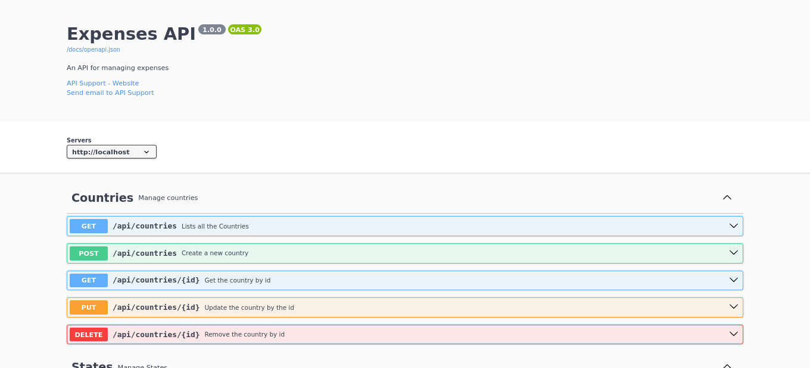

# API de Registro de Gastos Personales con Laravel

Este es un proyecto de API desarrollado con Laravel para el registro de gastos personales. Proporciona endpoints para la creación, consulta, actualización y eliminación de registros de gastos.

## Requisitos

-   PHP 7.4 o superior
-   Composer
-   Laravel 8
-   Postgresql

## Instalación

1. Clona el repositorio: `git clone https://github.com/acristhian1411/Expenses-with-laravel.git`
2. Accede al directorio del proyecto: `cd Expenses-with-laravel`
3. Instala las dependencias: `composer install`
4. Copia el archivo de configuración: `cp .env.example .env`
5. Configura la base de datos en el archivo `.env`
6. Genera la clave de la aplicación: `php artisan key:generate`
7. Ejecuta las migraciones: `php artisan migrate`
8. Lanza la aplicación: `php artisan serve`
9. Ve a la documentación de la api en: `http://localhost:8000/docs`

## Imagenes relacionadas

